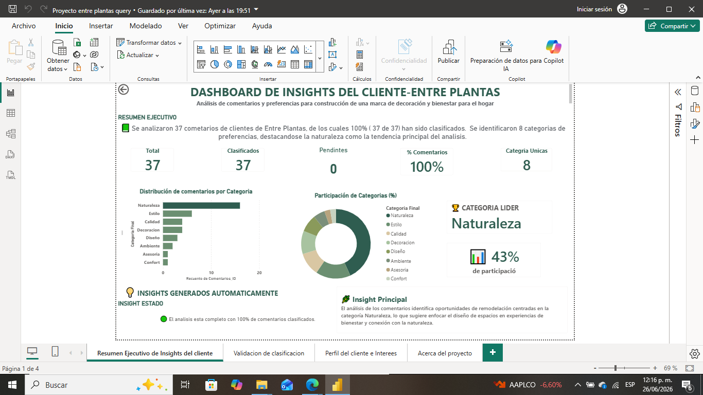
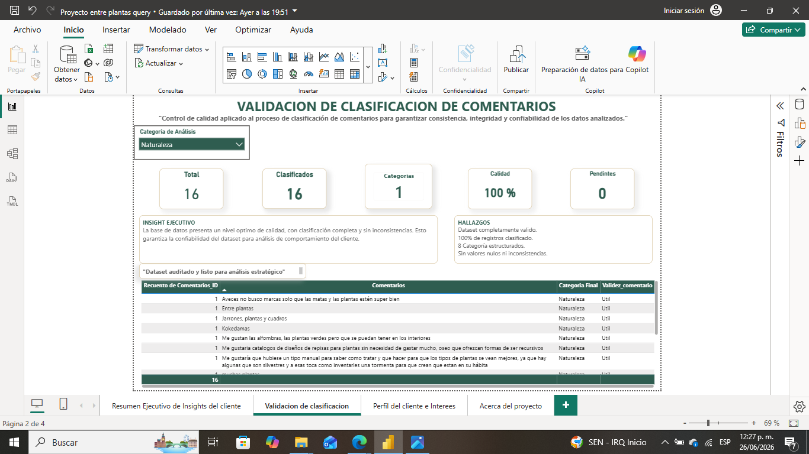
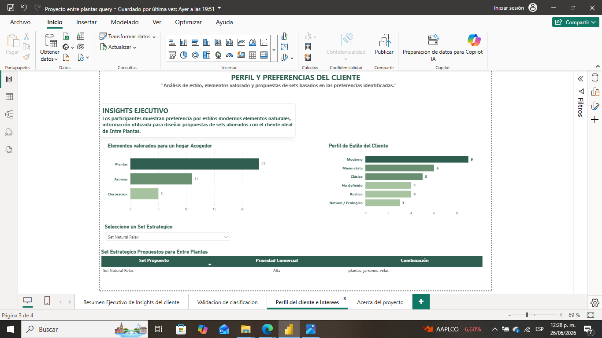
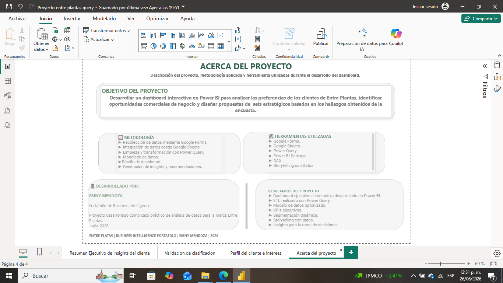

 🌿 Power BI - Entre Plantas

## 📌 Descripción del proyecto

Este proyecto presenta un dashboard desarrollado en **Power BI** para analizar las preferencias y comentarios de clientes de **Entre Plantas**, una marca enfocada en decoración, bienestar y naturaleza.

El objetivo fue transformar datos obtenidos mediante una encuesta en información útil para apoyar la toma de decisiones sobre productos, diseño de marca y experiencia del cliente.

---

## 🎯 Objetivos

- Analizar las preferencias de los clientes.
- Clasificar comentarios por categorías.
- Identificar tendencias de compra.
- Construir un dashboard ejecutivo para apoyar decisiones de negocio.

---

## 🛠 Herramientas utilizadas

- Power BI
- Power Query
- DAX
- Google Forms
- Google Sheets
- Microsoft Excel

---

## 📂 Archivos del proyecto

- 📊 EntrePlantas_Dashboard.pbix
- 📄 Encuesta_Entre_Plantas.xlsx
- 🖼 Capturas del dashboard

---

## 📈 Dashboard

### Resumen Ejecutivo

---

### Validación de Clasificación

---

### Perfil del Cliente e Intereses

---

### Acerca del Proyecto

---

## 🔍 Principales Insights

- Se analizaron 37 comentarios de clientes.
- Se clasificó el 100% de los comentarios.
- Se identificaron 8 categorías de preferencias.
- La categoría líder fue **Naturaleza**, con una participación del 43%.

---

## 👤 Autor

**Emny Mendoza**

Business Intelligence | Power BI | Excel | Análisis de Datos

Actualmente desarrollo proyectos orientados a convertir datos en información útil para apoyar la toma de decisiones.

---

## 🚀 Estado del proyecto

✅ Finalizado
